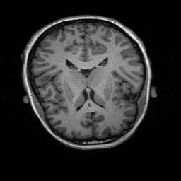
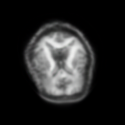

# PET synthesis from MRI

## Software and hardware platform
- AMD Instinct MI210 
- ROCm 6.1
- TensorFlow 2.13 ROCm 6.1
- Pytorch 2.0.1_ROCm6.1.2
- Ubuntu 20.04

## What we want to try
- [x] 2D CycleGAN
- [x] 3D CycleGAN
- [x] Accelerate using ROCm rather than CUDA
 
## 2D CycleGAN

### 1.Get the data
First, we have a large amount of initial data, with each initial data folder representing a patient. For example:
```bash
(cv) ➜  B10081264 tree
.
├── A4_B10081264_MR_DWI_Br_20201121023309054_S851227_I1375270.nii.gz
├── A4_B10081264_MR_FLAIR__DeFaced_Br_20201111192440421_S851236_I1365759.nii.gz
├── A4_B10081264_MR_Florbetapir_Br_20210214125609391_S989842_I1410362.nii.gz
├── A4_B10081264_MR_T1__GradWarp__DeFaced_Br_20201111104015448_S851230_I1364445.nii.gz
├── A4_B10081264_MR_T2_SE__DeFaced_Br_20201112103907914_S851228_I1367106.nii.gz
├── A4_B10081264_MR_T2_star_Br_20201116190317999_S851229_I1369972.nii.gz
├── A4_B10081264_MR_fMRI_rest_Br_20201124164344053_S851232_I1377521.nii.gz
├── CR4A4_B10081264_MR_Florbetapir_Br_20210214125609391_S989842_I1410362.nii.gz
├── CRA4_B10081264_MR_FLAIR__DeFaced_Br_20201111192440421_S851236_I1365759.nii.gz
├── CRA4_B10081264_MR_Florbetapir_Br_20210214125609391_S989842_I1410362.nii.gz
├── CRA4_B10081264_MR_T1__GradWarp__DeFaced_Br_20201111104015448_S851230_I1364445.nii.gz
├── CRA4_B10081264_MR_T2_SE__DeFaced_Br_20201112103907914_S851228_I1367106.nii.gz
├── CRA4_B10081264_MR_T2_star_Br_20201116190317999_S851229_I1369972.nii.gz
├── R4A4_B10081264_MR_Florbetapir_Br_20210214125609391_S989842_I1410362.nii.gz
├── RA4_B10081264_MR_FLAIR__DeFaced_Br_20201111192440421_S851236_I1365759.nii.gz
├── RA4_B10081264_MR_Florbetapir_Br_20210214125609391_S989842_I1410362.nii.gz
├── RA4_B10081264_MR_T1__GradWarp__DeFaced_Br_20201111104015448_S851230_I1364445.nii.gz
├── RA4_B10081264_MR_T2_SE__DeFaced_Br_20201112103907914_S851228_I1367106.nii.gz
├── RA4_B10081264_MR_T2_star_Br_20201116190317999_S851229_I1369972.nii.gz
├── aseg.nii.gz
├── brainmask.nii.gz
└── wmparc.nii.gz

0 directories, 22 files
```
Here, we select one T1 as MRI and one Florbetapir_Br as PET, extracting 50 patients from the original dataset to form a new dataset.(For 3D methods, the computational complexity is higher compared to 2D methods.)
```python
python extract_files.py
```
### 2.Data preprocess
Here, our neural network requires image inputs, but our dataset is in NIfTI format, so it needs to be converted to JPG images.
```python
python data_preprocess.py
```
### 3.Train
```python
python train.py --dataroot ./datasets/mri2pet --name mri2pet --model cycle_gan --display_id -1
```
### 4.Test
```python
python test.py --dataroot ./datasets/mri2pet --name mri2pet --model cycle_gan
```
or
```python
python test.py --dataroot ./datasets/mri2pet/testA --name mri2pet --model test --no_dropout --model_suffix _A --num_test 10
```
The first one is bidirectional, while the second one is unidirectional.
Here is an example,the first one is the MRI image, and the second one is the synthesized PET image:





## 3D CycleGAN
Here, we use 3D CycleGAN to synthesize PET from MRI.

### 1.Get the data
We need to perform similar processing on the data as we did earlier. The difference here is that the PET images require separate handling. This is because MRI images are three-dimensional, while PET images are four-dimensional, with the fourth dimension being time. Here, we need to calculate the average over the time dimension.
```python 
python data_split.py
```
### 2.Train
To run the training code, you need to specify some parameters. Here is a feasible example. You can modify it based on your hardware capabilities.
If this is your first time training.
```bash
python main.py path/to/data/directory path/to/save/results
```
If you have trained before, you can use the following command.
```python
python main.py --data_path ~/PatchBased_3DCycleGAN_CT_Synthesis/datasets/mri2pet/ --out_path ~/PatchBased_3DCycleGAN_CT_Synthesis/results/ --resume_training True --pretrained_path ~/PatchBased_3DCycleGAN_CT_Synthesis/results/20240731-170027/saved_weights/ --max_iterations 20 --save_train_freq 5
```

## References
- CycleGAN and pix2pix in PyTorch https://github.com/junyanz/pytorch-CycleGAN-and-pix2pix
- PatchBased_3DCycleGAN_CT_Synthesis https://github.com/rekalantar/PatchBased_3DCycleGAN_CT_Synthesis
